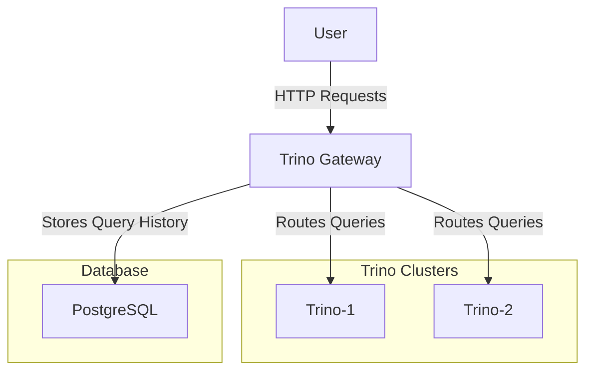

# Trino Gateway

## Overview
The Trino Gateway is a high-availability gateway for Trino clusters. It provides routing, query history, and resource management for multiple Trino backends.

## Architecture



## Prerequisites
- Docker
- Docker Compose

## Running the Trino Gateway
1. **Build the Docker images:**
   ```sh
   docker-compose build
   ```

2. **Start the services:**
   ```sh
   docker-compose up -d
   ```

3. **Verify the services:**
   - Trino Gateway: [http://localhost:8080](http://localhost:8080)
   - Trino-1: [http://localhost:8081](http://localhost:8081)
   - Trino-2: [http://localhost:8082](http://localhost:8082)
   - PostgreSQL: [http://localhost:5432](http://localhost:5432)

## Configuration

### Gateway Configuration
The gateway configuration is located in 

gateway-ha-config.yml

. It includes settings for server configuration, data store, authentication, and authorization.

### Certificates
The public and private keys for authentication are located in the 

certs

 directory.

### Logging
Logging configuration is defined in 

log.properties

.

## Database Initialization
The PostgreSQL database is initialized with the scripts located in the 

trino-gateway

 directory:
- init-user-db.sh
- create-multiple-postgresql-databases.sh

## Health Checks
Health checks are configured for all services in the 

docker-compose.yml

 file to ensure they are running correctly.

## Stopping the Services
To stop the services, run:
```sh
docker-compose down
```
